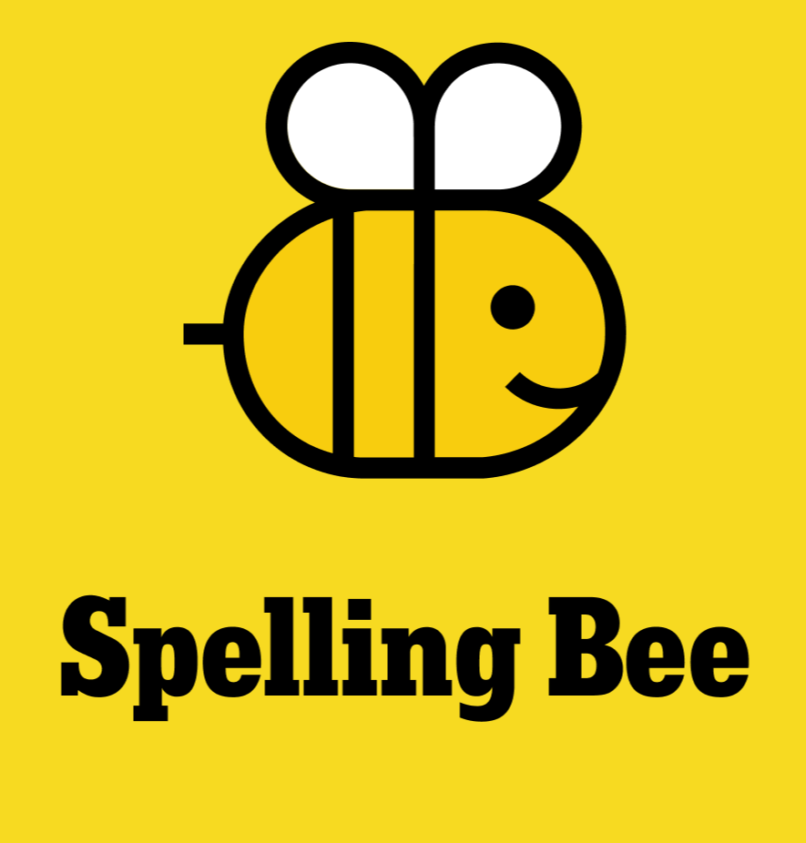

# spelling-beer

This is a python version of the Spelling Bee Game, adapting the setup by the New York Times puzzle. Currently, the game can be played by running the `main.py` file.

---

**Rules:** Try to form as many words as you can with the provided letters. The center letter (indicated by paranthesis `(X)`) must be included in every word, while the other letters don't. Letters can be used multiple times.
Scoring:
- Words with less than 4 letters do not count, 4-letter words score 1 point.
- Every longer word offers 1 point per letter.
- A pangram is a word that uses every letter at least once. These are worth 7 extra points!

---

The default dictionary is `en_US_60_SB.txt`, which is my attempt to replicate the word list of the NYT as closely as possible. It is based on the en_US.60 SCOWL word list, removing proper nouns, special characters and inappropriate language (the last one being a work-in-progress, feedback appreciated). I compared some of the daily puzzle's solutions with these to adjust the list.
You can also use your own dictionary.

---

To start the game, you can either enter your own word or combination of letters, or you can use `!generate` to get set of 7 letters with at least two vowels. This option also guarantees that there is at least one pangram to be found! During the game, you can enter `!help` to show a list of available commands.

---

To do:
- End Game: Graphical interface

